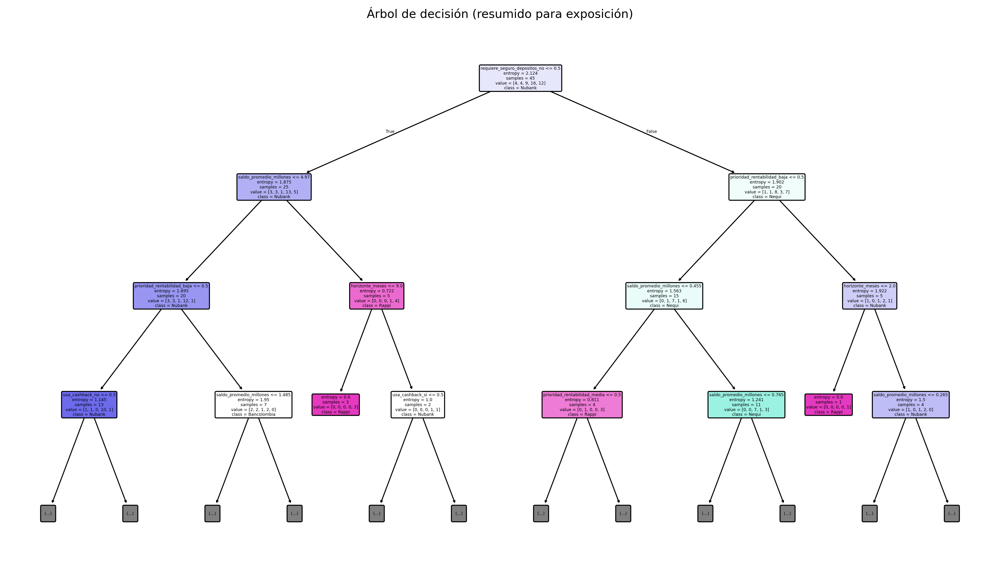

# Proyecto: Árbol de decisión para elegir la mejor cuenta de ahorro

## Cómo ejecutar el proyecto
1. Clona este repositorio.
2. Instala dependencias: `pip install -r requirements.txt`
3. Corre el archivo principal: `python main.py`

## Visualizaciones
Árbol resumido:

Árbol completo:

## ¿Cuál es la mejor cuenta de ahorro para dejar el dinero?

### Cómo queda la base de datos (esquema)
Cada fila representa el perfil de un usuario y la cuenta recomendada para él. Columnas:

- **horizonte_meses** (numérico: 1, 3, 6, 12)  
- **saldo_promedio_millones** (numérico: 0.3, 0.5, 1.0, 2.0, 5.0, 10.0, …)  
- **prioridad_rentabilidad** (categórica: baja, media, alta)  
- **prioridad_liquidez** (categórica: baja, media, alta)  
- **tolerancia_costo** (categórica: baja, media, alta)  
- **requiere_seguro_depositos** (categórica: si, no)  
- **usa_cashback** (categórica: si, no)  
- **cuenta_recomendada** (CLASE a predecir: {Nubank, Rappi, Bancolombia, Nequi, Davivienda})

---

## Paso a paso (alineado con DataCamp)

A. Importar librerías (pandas, scikit-learn)  
B. Cargar y explorar los datos.  
C. Separar variables: **X** (todas las columnas menos cuenta_recomendada) y **y** (la clase).  
D. Preprocesar categóricas con One-Hot Encoding (scikit-learn).  
E. Entrenar el modelo **DecisionTreeClassifier**, predecir y evaluar con **accuracy_score**.  
F. Visualizar el árbol (con `plot_tree`).  
G. Afinar hiperparámetros (`criterion="entropy"`, `max_depth=3`) para mejorar generalización.  

---

## Explicación

- **Problema:** Clasificación multiclase: predecir la cuenta de ahorro recomendada dada la prioridad del usuario.  
- **Flujo:** importar → cargar → dividir en train/test → codificar categóricas → entrenar → evaluar → visualizar.  
- **Métrica:** accuracy_score + matriz de confusión.  
- **Interpretación:** el gráfico del árbol muestra reglas como “si liquidez es alta y usa cashback → Rappi”.  
- **Limitación:** se usan datos sintéticos; en un estudio real habría que recolectar condiciones actuales y usuarios reales.  

---

## Análisis

- **Nodo raíz:** es la primera división más importante. En este caso, `requiere_seguro_depositos`.  
- **Nodos intermedios:** representan preguntas de sí/no (ej: `saldo_promedio_millones <= 4.97`).  
- **Hojas:** son las decisiones finales (ej: class = Nubank).  

Ejemplo de nodo:
    - saldo_promedio_millones <= 4.97
    - entropy = 1.27
    - samples = 23
    - value = [3, 12, 5, 3]
    - class = Nubank

---

## Interpretación de resultados

- Si el usuario pide **seguro de depósitos** → el árbol suele recomendar **Nubank** o **Bancolombia**.  
- Si no pide seguro → la variable más influyente es el **saldo promedio**.  
- Saldo bajo + liquidez alta → **Nequi** o **Rappi**.  
- Saldo alto + tolerancia a costo → **Bancolombia** o **Nubank**.  
- Si usa **cashback** → el árbol activa la rama de **Rappi**.  

---

## ¿Para qué sirve?

- **Entender patrones:** qué pesa más en la decisión.  
- **Automatizar recomendaciones:** escoger rápido la cuenta ideal.  
- **Explicabilidad:** fácil de mostrar porque son reglas tipo “si… entonces…”.  
- **Aplicación práctica:** se puede integrar a una app de finanzas personales.  

---

## ¿Por qué no hay una única mejor cuenta?

Un árbol de decisión no busca un único ganador, sino recomendaciones personalizadas.  

Ejemplos:
- Usuarios que valoran **cashback y liquidez inmediata** → **Rappi**.  
- Usuarios que quieren **seguridad y rentabilidad alta** → **Nubank**.  
- Usuarios con **saldo pequeño y poca tolerancia a costos** → **Nequi**.  

En otras palabras: no existe una mejor cuenta absoluta, sino la mejor según el perfil del usuario.
